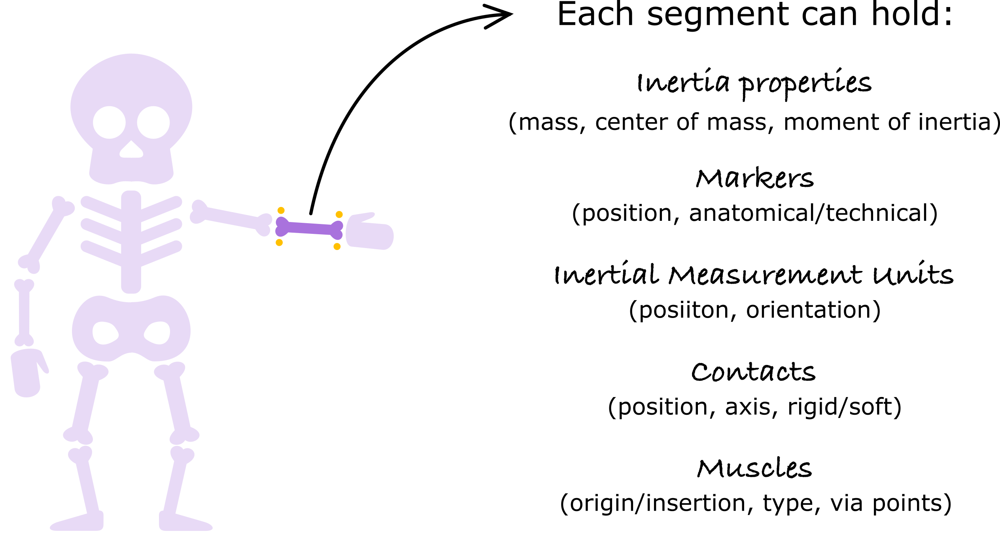
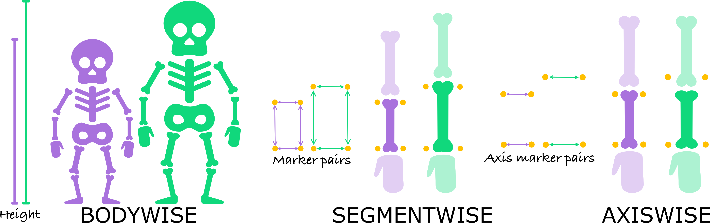
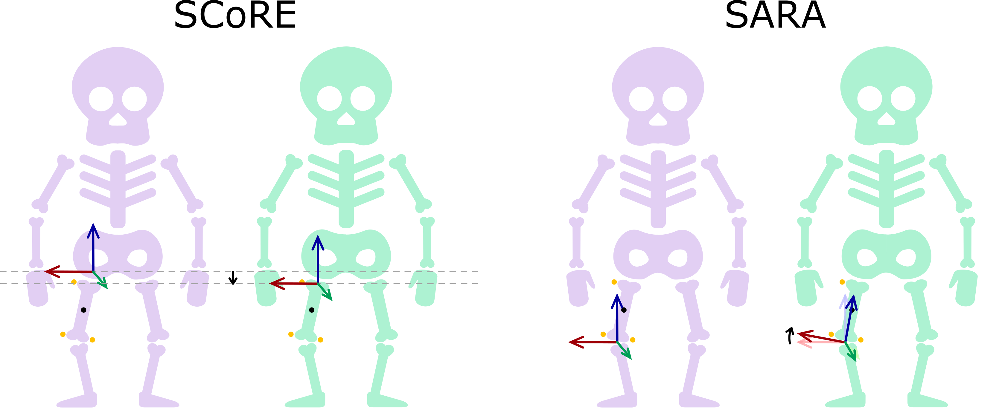

`BioBuddy` is an open-source tool for [translating](#model-translation), [creating](#model-creation) and [personalizing](#model-personalization) musculoskeletal models across different formats (e.g., .osim, .bioMod). By enabling reliable interoperability between modeling environments, BioBuddy allows researchers to focus on scientific questions rather than technical constraints.

<!---
[](https://github.com/pyomeca/biobuddy/actions)
[](https://pypi.org/project/biobuddy/)
--->

[](https://codecov.io/gh/pyomeca/biobuddy)
[](https://discord.gg/Ux7BkdjQFW)

# How to install 
Currently, the only way to install `BioBuddy` is from source. But it will be available on conda-forge and pip in the near future.

If you are a user, you can set up your environment with minimal dependencies.
```bash
conda install -c conda-forge python=3.11.11 pip
pip install scipy==1.15.1 numpy lxml ezc3d
```
Note: On mac, you might need to add `conda install conda-forge::libcxx`

However, if you are a developer and want to contribute, you will need to set up your environment using the following command:
Due to the OpenSim dependency used only in BioBuddy's tests, we recommend using python=3.11.
```bash
pip install pytest pytest-cov codecov
conda install -c opensim-org opensim=4.5.1
conda install -c conda-forge biorbd=1.11.2 deepdiff
```

# Model translation
You can load the original model using one of the `BiomechanicalModelReal().from_[format]` methods, and then export it 
into another format using the `BiomechanicalModelReal.to_[format]` method (see [example](examples/read_and_write_models.py)).
```python3
from biobuddy import BiomechanicalModelReal

# Read an .osim file
model = BiomechanicalModelReal().from_osim(
    filepath=osim_filepath,
    # Other optional parameters here
)

# Translate it into a .bioMod file
model.to_biomod(biomod_filepath)
```

# Model creation
A model can also be created from scratch using the `BiomechanicalModel`. In this generic model, everything can be defined 
through functions (i.e., without numerical values). The subject specific model (a `BiomechanicalModelReal`) can then be 
generated by evaluating the generic model with a motion capture trial. This feature is especially useful for kinematic 
models where the joint centers are defined based on anatomical marker placement (like in the plug in gait, see full 
[example](examples/create_model_from_c3d.py)). 

Here is a simple example of how to add components to such a model:
```python3

# Create the model
model = BiomechanicalModel()
de_leva = DeLevaTable(total_mass=60, sex=Sex.FEMALE)

# Add components to build the kinematic chain
model.add_segment(
    Segment(
        name="HEAD",
        parent_name="TRUNK",
        segment_coordinate_system=SegmentCoordinateSystem(
            "BOTTOM_HEAD",
            first_axis=Axis(name=Axis.Name.Z, start="BOTTOM_HEAD", end="HEAD_Z"),
            second_axis=Axis(name=Axis.Name.X, start="BOTTOM_HEAD", end="HEAD_XZ"),
            axis_to_keep=Axis.Name.Z,
        ),
        mesh=Mesh(("BOTTOM_HEAD", "TOP_HEAD", "HEAD_Z", "HEAD_XZ", "BOTTOM_HEAD")),
        inertia_parameters=de_leva[SegmentName.HEAD],
    )
)
model.segments["HEAD"].add_marker(Marker("BOTTOM_HEAD"))
model.segments["HEAD"].add_marker(Marker("TOP_HEAD"))
model.segments["HEAD"].add_marker(Marker("HEAD_Z"))
model.segments["HEAD"].add_marker(Marker("HEAD_XZ"))

# Evaluate the model with a motion capture trial
model_real = model.to_real(C3dData(c3d_filepath))
```

There are many different components available to build a model (see this [example](examples/create_model.py) to see how to add those components to your model).



# Model personalization
The current version of BioBuddy allows you to modify your `BiomechanicalModelReal` to personalize it to your subjects by:
- [Scaling](###scaling)
- [Identifying joint centers](###joint-center-identification)

### Scaling:
The scaling is performed by the `ScaleTool` which can be initialized from scratch like this:
```python3
original_model = BiomechanicalModelReal()

# Create the scaling configuration
scaling_configuration = ScaleTool(original_model)

# Add a scaling segment for the pelvis
scaling_configuration.add_scaling_segment(
    SegmentScaling(
        name="pelvis",
        scaling_type= SegmentWiseScaling(
            axis=Translations.XYZ,
            marker_pairs=[
                ["RASIS", "LASIS"],
                ["RPSIS", "LPSIS"],
            ]
        )
    )
)

# Add marker weights for the pelvis segment
scaling_configuration.add_marker_weight(MarkerWeight(name="RASIS", weight=1.0))
scaling_configuration.add_marker_weight(MarkerWeight(name="LASIS", weight=1.0))
scaling_configuration.add_marker_weight(MarkerWeight(name="RPSIS", weight=0.5))
scaling_configuration.add_marker_weight(MarkerWeight(name="LPSIS", weight=0.5))
```
or by reading from an existing file (e.g., `.xml` or `.biomod`) using the appropriate `ScaleTool.from_[format]` method.
Once the scaling configuration is set up, you can scale your model based on a static trial (`.c3d` file) and the total 
mass of your participant using the `ScaleTool.scale` like this:
```python3
# Performing the scaling based on a static trial
scale_tool = ScaleTool.from_biomod(biomod_filepath)
scaled_model = scale_tool.scale(static_c3d=C3dData(filepath), mass=mass)
```

For now, there are three scaling methods available:
- `BodyWiseScaling`: scales the entire body based on the total height of the participant.
- `SegmentWiseScaling`: scales the segment based on the distance between marker pairs.
- `AxisWiseScaling`: scales each axis of the segment independently based on the distance between marker pairs.


### Joint center identification:
The `JointCenterTool` allows you to identify the joint centers of your model based on the movement of segments during 
functional trials.
First, you need to define the joint center configuration using `JointCenterTool.add()` method to define the joint 
you want to modify.
Then, you can use the `JointCenterTool.replace_joint_centers()` method to modify each joint.
```python3
from biobuddy import JointCenterTool

# Set up the joint center identification tool
joint_center_tool = JointCenterTool(scaled_model)
# Example for the right hip
joint_center_tool.add(
    Score(
        functional_c3d=C3dData(c3d_filepath, first_frame=100, last_frame=900),
        parent_name="pelvis",
        child_name="femur_r",
        parent_marker_names=["RASIS", "LASIS", "LPSIS", "RPSIS"],
        child_marker_names=["RGT", "RUB_Leg", "RUF_Leg", "FBF_Leg", "RMFE", "RLFE"],
    )
)
# Example for the right knee
joint_center_tool.add(
    Sara(
        functional_c3d=C3dData(c3d_filepath),
        parent_name="femur_r",
        child_name="tibia_r",
        parent_marker_names=["RGT", "RUB_Leg", "RUF_Leg", "FBF_Leg"],
        child_marker_names=["RATT", "RUB_Tib", "RDF_Tib", "RDB_Tib", "RSPH", "RLM"],
    )
)

# Perform the joint center identification
modified_model = joint_center_tool.replace_joint_centers()
```
For now, two algorithms were implemented `SCoRE` to locate the position of the joint center and `SARA` 
to identify the joint axis of rotation. Please note that in both cases, all segment components stay the same, only the 
joint position and axis are modified.



# How to cite
```
@software{biobuddy_2025,
  author       = {Eve Charbonneau, Pierre Puchaud, Teddy Caderby, Mickael Begon, Amedeo Ceglia, Benjamin Michaud},
  title        = {Bringing the musculoskeletal modeling community together with BioBuddy},
  month        = april,
  year         = 2025,
  publisher    = {submitted to Congrès de la Société de biomécanique},
  url          = {https://github.com/pyomeca/biobuddy}
}
```

# How to contribute
Our goal is to support as many musculoskeletal model formats as possible, so do not hesitate to contact us if you'd like to see your favorite format supported by BioBuddy. 
If you are using BioBuddy and encounter any problem, please open an issue on this GitHub repository. 
We are also open to suggestions for new features or improvements to existing functionality.
All contributions are welcome!
